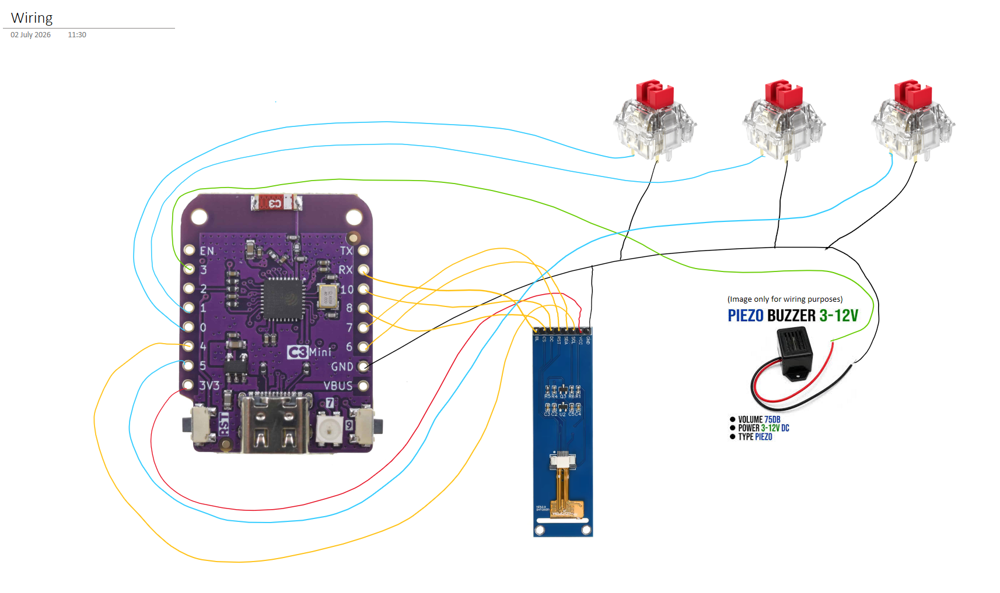
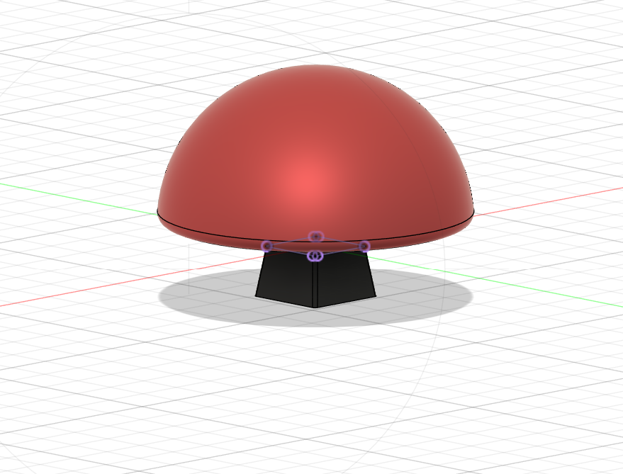

# Blare Alarm Clock

An alarm clock that I designed with the theme of a "Big Red Button" in mind.

You can follow my progress by looking in the Journal folder.

**Features**

* A big red button
* 3 buttons: the big red button shuts off the alarm, and the two on the side are used to navigate different functions
* 2.25in TFT Screen
* Utilises a 1x Lolin C3 Mini ESP 32 Devboard
* Shows the time as a normal clock should
* Easy to set up an alarm using the side buttons
* Has a 3.3V piezo buzzer that buzzes when the alarm goes off until the big red button is pressed

**Wiring**

I will be following the wiring schematic shown in the picture above.

**Design**

I designed all my parts in Fusion.

This is the casing I designed.

This is the backplate I designed to fit on the back of the casing.

This is the keycap I designed, intended to go on the center top switch to shut off the alarm (big red button). I used a model from GrabCAD as a template and built off of it.

I have exported all of the .STEP files, which you can find in the Case Files folder.

**Firmware**

I wrote the firmware in Arduino IDE.

You can find this in the Firmware folder.

**BOM**

* 1x Lolin C3 Mini ESP 32 Devboard
* 3x Keyboard Switches
* 1x 2.25in TFT Screen
* 1x 3.3V Piezo Buzzer
* 1x Custom casing
* 1x Custom keycap
* 2x Regular keycaps

 

This was designed by my as a submission for Hack Club Blare.